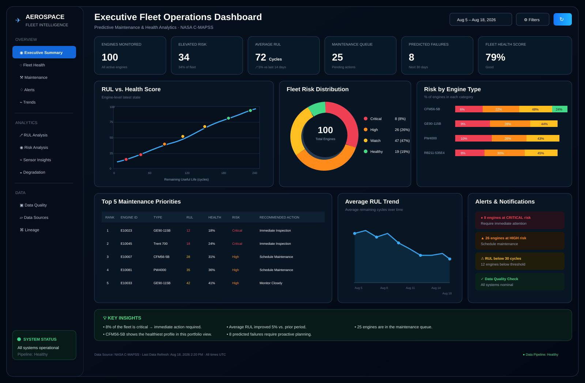

# ✈️ Aerospace Fleet Intelligence

> **Executive-grade Azure Data Engineering portfolio project** turning NASA C-MAPSS turbofan telemetry into fleet-health, predictive-maintenance and operational decision analytics.

**Azure Data Factory → ADLS Gen2 → Databricks / PySpark → dbt → Synapse Analytics → Dashboard**

<div align="center"></div>

## 🎯 What this project delivers

A complete data product — **ingest → store → transform → test → model → serve → analyze** — built around a concrete business decision:

> **Which engines should maintenance planners review first, how much useful life remains, and where should scarce maintenance capacity be allocated?**

### 🧰 Engineering stack

`Azure Data Factory` · `ADLS Gen2` · `Azure Databricks` · `PySpark` · `Delta Lake` · `dbt` · `Azure Synapse` · `SQL` · `Python` · `Streamlit` · `Plotly` · `GitHub Actions`

### 📌 Business outputs

- 🚨 Fleet risk ranking
- ⏱️ Remaining Useful Life (RUL)
- 🔧 Maintenance priority queue
- 📈 Health vs. RUL analysis
- 📊 Risk by engine type
- 🧭 Capacity-aware intervention planning
- 💰 Assumption-driven maintenance scenarios
- ✅ Tested, warehouse-ready Gold layer

> **Portfolio note:** C-MAPSS is simulated engine-degradation data. The project demonstrates engineering and analytics patterns; it is not a certified aviation safety or maintenance system.

## 📊 Executive dashboard

The dashboard is intentionally designed like an operations product rather than a notebook screenshot. It provides:

| View | Business decision |
|---|---|
| 🚦 Fleet risk distribution | Where is risk concentrated? |
| ⏱️ RUL vs. health | Which engines have less remaining life? |
| 🔧 Maintenance priorities | What should planners review first? |
| 📈 RUL trend | Is fleet condition changing? |
| 🚨 Alerts | What requires immediate attention? |
| 💡 Key insights | What action should management take? |

## 💡 Key portfolio insights

### 🚨 1. Prioritize before failure
C-MAPSS provides run-to-failure training trajectories and test trajectories that stop before failure. The strongest business story is therefore **early-warning maintenance prioritization**, not post-failure detection.

### ⏱️ 2. RUL becomes the planning language
Remaining Useful Life expressed in operating cycles gives planners a consistent comparison measure while the Silver layer preserves detailed engine × cycle telemetry.

### 🔧 3. Analytics must become an action
The Gold layer converts risk into a recommended action — immediate review, scheduled intervention, increased monitoring or routine monitoring — so the output is a **maintenance queue**, not just a model score.

### 👥 4. Capacity matters
When maintenance capacity is limited, the queue can be ranked by risk and RUL so the highest-priority engines consume scarce intervention slots first.

### 💰 5. Economics stay credible
Maintenance cost, downtime cost and capacity are explicit scenario assumptions. The project does **not** fabricate savings from simulated aerospace data.

## 📊 Business questions answered

| Question | Answer from the analytical layer |
|---|---|
| 🚨 **Which engines need attention first?** | Rank latest engine states by health, RUL and risk. |
| ⏱️ **How much life remains?** | Compare engines using RUL cycles. |
| 🚦 **Where is risk concentrated?** | Aggregate engine snapshots into CRITICAL / HIGH / WATCH / HEALTHY bands. |
| 🔧 **What should happen next?** | Translate each risk band into a maintenance action. |
| 👥 **What if capacity is constrained?** | Prioritize the highest-risk candidates within available maintenance capacity. |
| 📈 **Is fleet condition changing?** | Track RUL and health trends over time. |

Detailed analysis: [`docs/business_insights.md`](docs/business_insights.md) · [`docs/portfolio_results.md`](docs/portfolio_results.md)

## 🏗️ Architecture

<div align="center"></div>

**NASA C-MAPSS → ADF → ADLS Bronze → Databricks/PySpark → ADLS Silver/Gold → dbt → Synapse → Dashboard**

## 🔄 Data engineering flow

### 1. 🛬 Ingest — Azure Data Factory
Parameterized ingestion accepts the dataset/source and Bronze destination, keeping source capture separate from transformation for replayability.

### 2. 🗄️ Store — ADLS Gen2
A clean Bronze / Silver / Gold lake pattern provides durable boundaries between raw telemetry, standardized data and business-ready outputs.

### 3. ⚙️ Transform — Databricks + PySpark
Explicit schema enforcement, duplicate detection, cycle validation, RUL derivation, sensor features, health scoring and risk classification.

### 4. 🧪 Model — dbt
Reusable staging and marts with uniqueness, relationship, accepted-value and health-score tests.

### 5. 🏢 Serve — Synapse
Curated warehouse objects and business views expose the analytical contract to BI consumers.

### 6. 📊 Decide — Dashboard
Executive KPIs, fleet risk, RUL, maintenance priorities, alerts and trends turn the data into an operational decision layer.

## 📁 Repository structure

```text
adf/                 Azure Data Factory datasets + pipelines
assets/              Executive dashboard + architecture SVGs
dashboard/           Streamlit + Plotly dashboard
data/raw/            Raw-data policy / local source downloads
data/reference/      Schema contracts and source metadata
databricks/          PySpark Bronze → Silver → Gold jobs
dbt/                 Staging models, marts and tests
docs/                Architecture, runbook, insights, results
notebooks/           Reproducible exploratory analytics
scripts/             Source-data acquisition
src/                 Reusable Python analytics logic
synapse/             Warehouse DDL + business views
tests/               Automated Python validation
.github/workflows/   CI
```

## 🚦 Risk framework

| Band | Action |
|---|---|
| 🔴 **CRITICAL** | Immediate review |
| 🟠 **HIGH** | Schedule intervention |
| 🟡 **WATCH** | Increase monitoring |
| 🟢 **HEALTHY** | Routine monitoring |

The health score is an **interpretable portfolio prioritization heuristic**, not an aviation-certified prediction model.

## 🧪 Data quality & reliability

- explicit source schema
- engine/cycle duplicate checks
- cycle validation
- required-field checks
- health-score `[0,100]` contract
- dbt uniqueness and relationship tests
- accepted risk values
- GitHub Actions CI
- replayable Bronze boundary
- full raw archive excluded from Git history

## 🗃️ Data source

**NASA — C-MAPSS Jet Engine Simulated Data**

https://data.nasa.gov/dataset/cmapss-jet-engine-simulated-data

The full archive is deliberately not committed to GitHub. Run `scripts/download_cmapss.py` when required. The schema contract is maintained in `data/reference/cmapss_schema.md`.

## 🚀 Production evolution

Managed Identity + Key Vault, Purview/Unity Catalog governance, metadata-driven ADF ingestion, incremental Delta processing, Azure Monitor/Log Analytics, environment promotion, data contracts, model registry and platform cost monitoring are natural production extensions.

## 📚 Documentation

- [`docs/architecture.md`](docs/architecture.md)
- [`docs/runbook.md`](docs/runbook.md)
- [`docs/business_insights.md`](docs/business_insights.md)
- [`docs/portfolio_results.md`](docs/portfolio_results.md)
- [`docs/portfolio_walkthrough.md`](docs/portfolio_walkthrough.md)

## 👨‍💻 Author

**Manish Reddy Kallu** · Data Engineering Portfolio

[GitHub](https://github.com/manishkallu01-wq) · [LinkedIn](https://www.linkedin.com/in/manish-reddy-kallu/)

---

**Independent portfolio project using public/simulated data. It does not represent NASA, an airline, an aircraft manufacturer, or a certified aviation maintenance workflow.**
