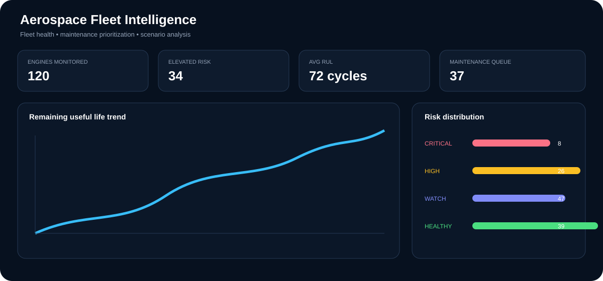

# ✈️ Aerospace Fleet Intelligence

> End-to-end Azure Data Engineering project that turns NASA C-MAPSS engine-degradation data into a clean, testable, business-facing analytics platform.

**ADF → ADLS Gen2 → Databricks / PySpark → dbt → Synapse Analytics → Dashboard**

<div align="center"></div>

## Overview

This portfolio project demonstrates the full data-engineering path from raw aerospace telemetry to analytical decisions. It focuses on **ingestion, lakehouse design, distributed processing, data quality, dimensional modeling, warehouse serving, and business analytics** rather than a standalone ML notebook.

### Business questions

- Which engines should maintenance planners review first?
- How does remaining useful life (RUL) change across the fleet?
- Which engines show stronger degradation or sensor instability?
- How should maintenance opportunities be prioritized?
- What does a maintenance strategy look like under explicit cost and capacity assumptions?

> **Scope:** C-MAPSS is simulated engine-degradation data. This is an independent portfolio implementation, not a certified aviation maintenance or safety system.

## Architecture

<div align="center"></div>

## Repository structure

```text
adf/                 ADF datasets and parameterized ingestion pipeline
assets/              SVG diagrams and project visual
dashboard/           Streamlit business dashboard
data/raw/            Small C-MAPSS-shaped sample + source documentation
data/reference/      Source schema metadata
data/processed/      Contract for ADLS-derived outputs
databricks/          PySpark Bronze → Silver → Gold notebooks
dbt/                 Staging, marts, tests and Synapse profile example
docs/                Runbook, architecture and interview walkthrough
notebooks/            Local profiling and business-analytics notebooks
scripts/              NASA dataset acquisition helper
src/                 Reusable Python analytics logic
synapse/             Warehouse DDL and business views
tests/               Python unit tests
.github/workflows/   CI validation
```

## Technology stack

| Layer | Technology | Purpose |
|---|---|---|
| Ingestion | Azure Data Factory | Parameterized source ingestion and orchestration |
| Lake | ADLS Gen2 | Bronze / Silver / Gold storage |
| Processing | Databricks + PySpark | Distributed cleansing and feature engineering |
| Tables | Delta Lake | Replayable lakehouse outputs |
| Modeling | dbt | SQL models, tests and documentation |
| Warehouse | Azure Synapse Analytics | Curated SQL serving layer |
| Analytics | Streamlit + Plotly | Fleet and maintenance dashboard |
| CI | GitHub Actions | Automated test validation |

## Data flow

1. **ADF** copies the selected NASA dataset into the ADLS Bronze zone.
2. **Databricks/PySpark** enforces schema, removes engine/cycle duplicates, derives RUL and sensor features, calculates health, and applies quality gates.
3. **Gold** produces an engine-level analytical snapshot.
4. **dbt** builds `dim_engine`, `fct_engine_health`, `fct_maintenance_opportunity`, and `mart_fleet_kpis` with tests.
5. **Synapse** exposes curated tables and business views.
6. **Dashboard** presents fleet risk, RUL, maintenance priority, and scenario economics.

## Business analytics

### Health score

```text
Health Score =
    0.40 × RUL Risk
  + 0.25 × Degradation Trend
  + 0.20 × Sensor Instability
  + 0.15 × Cycle Age Risk
```

Risk bands are intentionally actionable:

| Risk | Action |
|---|---|
| CRITICAL | Immediate review |
| HIGH | Schedule intervention |
| WATCH | Increase monitoring |
| HEALTHY | Routine monitoring |

The dashboard also exposes editable assumptions for maintenance cost, failure cost, downtime, capacity, and RUL threshold. Results are **scenario estimates**, not real operational savings.

## Dashboard preview

<div align="center"></div>

> Dashboard values are illustrative portfolio-preview values, not NASA measurements or production claims.

## Data source

**NASA — CMAPSS Jet Engine Simulated Data**

https://data.nasa.gov/dataset/cmapss-jet-engine-simulated-data

NASA describes the dataset as multivariate engine time series containing operational settings, sensor measurements, sensor noise, training/test trajectories and RUL information. The repository keeps only a small sample; the full archive is downloaded locally with `scripts/download_cmapss.py` and ignored by Git.

## Run locally

```bash
python -m venv .venv
source .venv/bin/activate
pip install -r requirements.txt
pytest -q
streamlit run dashboard/app.py
```

Download the full source archive when required:

```bash
python scripts/download_cmapss.py
```

## Azure deployment path

1. Create an ADLS Gen2 `aerospace` filesystem.
2. Configure ADF HTTP and ADLS linked services using managed identity where possible.
3. Import `adf/datasets/*.json` and `adf/pipelines/pl_aerospace_ingestion.json`.
4. Import the Databricks notebooks and pass `dataset_id` as a job parameter.
5. Run Bronze → Silver → Gold processing.
6. Execute `synapse/01_create_schema.sql` and `synapse/02_business_views.sql`.
7. Configure dbt from `dbt/profiles.yml.example` using secure credentials.
8. Run `dbt debug`, `dbt run`, and `dbt test`.
9. Point the BI layer at the Synapse business views.

## Data quality

- Explicit PySpark schema enforcement
- Engine/cycle duplicate detection
- Required-field and cycle validation
- Health score contract `[0, 100]`
- dbt uniqueness, relationship and accepted-value tests
- Custom dbt health-score assertion
- GitHub Actions CI
- Raw-zone replay boundary

## Production hardening

Natural next steps include Managed Identity + Key Vault, Purview/Unity Catalog governance, incremental Delta processing, metadata-driven ADF ingestion, structured streaming, Azure Monitor, data contracts, environment promotion, model registry, and Databricks/Synapse cost monitoring.

## Documentation

- [`docs/runbook.md`](docs/runbook.md)
- [`docs/architecture.md`](docs/architecture.md)
- [`docs/portfolio_walkthrough.md`](docs/portfolio_walkthrough.md)
- [`dbt/README.md`](dbt/README.md)
- [`data/raw/README.md`](data/raw/README.md)

## Author

**Manish Reddy Kallu** — Data Engineering Portfolio

GitHub: https://github.com/manishkallu01-wq

LinkedIn: https://www.linkedin.com/in/manish-reddy-kallu/

## Disclaimer

Independent portfolio implementation using public/simulated aerospace data. It does not represent NASA, an airline, an aircraft manufacturer, or a certified aviation maintenance workflow. Cost calculations are scenario assumptions only.
