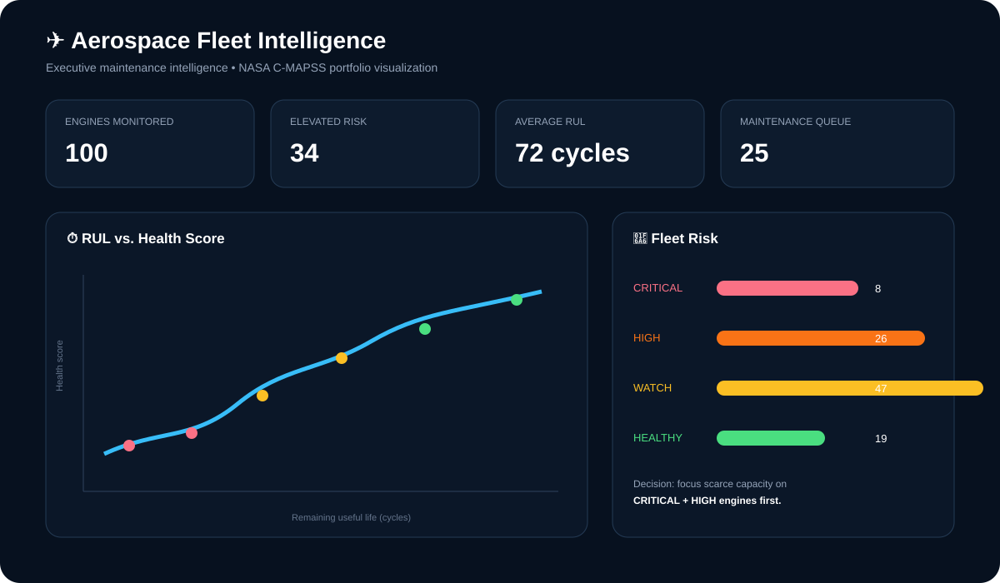

# ✈️ Aerospace Fleet Intelligence

> **Clean, production-style Data Engineering portfolio project** for turning NASA C-MAPSS turbofan engine telemetry into governed fleet-health and maintenance analytics.

**Azure Data Factory → ADLS Gen2 → Databricks / PySpark → dbt → Synapse Analytics → Dashboard**

<div align="center">
<svg xmlns="http://www.w3.org/2000/svg" width="1100" height="250" viewBox="0 0 1100 250" role="img" aria-label="Aerospace Fleet Intelligence architecture overview"><rect width="1100" height="250" rx="20" fill="#07111f"/><text x="40" y="42" fill="#ffffff" font-family="Arial" font-size="24" font-weight="700">✈️ Aerospace Fleet Intelligence</text><text x="40" y="66" fill="#94a3b8" font-family="Arial" font-size="12">Telemetry → governed lake → distributed processing → warehouse → decisions</text><g font-family="Arial" text-anchor="middle"><g fill="#102039" stroke="#38bdf8"><rect x="35" y="100" width="135" height="70" rx="12"/><rect x="190" y="100" width="135" height="70" rx="12"/><rect x="345" y="100" width="135" height="70" rx="12"/><rect x="500" y="100" width="135" height="70" rx="12"/><rect x="655" y="100" width="135" height="70" rx="12"/><rect x="810" y="100" width="135" height="70" rx="12"/><rect x="965" y="100" width="100" height="70" rx="12"/></g><g fill="#38bdf8" font-size="10" font-weight="700"><text x="102" y="125">SOURCE</text><text x="257" y="125">INGEST</text><text x="412" y="125">LAKE</text><text x="567" y="125">PROCESS</text><text x="722" y="125">MODEL</text><text x="877" y="125">SERVE</text><text x="1015" y="125">BI</text></g><g fill="#fff" font-size="12"><text x="102" y="147">NASA C-MAPSS</text><text x="257" y="147">ADF</text><text x="412" y="147">ADLS Gen2</text><text x="567" y="147">Databricks</text><text x="722" y="147">dbt</text><text x="877" y="147">Synapse</text><text x="1015" y="147">Dashboard</text></g></g><g stroke="#8b5cf6" stroke-width="3"><path d="M170 135h20M325 135h20M480 135h20M635 135h20M790 135h20M945 135h20"/></g><text x="40" y="215" fill="#a5b4fc" font-family="Arial" font-size="12">Fleet health • RUL • degradation • maintenance priority • scenario economics • data quality</text></svg>
</div>

> **Portfolio note:** C-MAPSS is simulated engine-degradation data. This project demonstrates data-engineering architecture and analytics patterns; it is not a certified aircraft safety or maintenance system.

## 🎯 Project at a glance

This project demonstrates the complete Data Engineering lifecycle — **ingest → store → transform → test → model → serve → analyze** — using an aerospace use case that has a clear operational decision behind it: **which engines should maintenance planners review first?**

### 🧰 Engineering stack

`Azure Data Factory` · `ADLS Gen2` · `Azure Databricks` · `PySpark` · `Delta Lake` · `dbt` · `Azure Synapse` · `SQL` · `Python` · `Streamlit` · `Plotly` · `GitHub Actions`

### 📌 Business outputs

- 🚦 Fleet risk ranking
- ⏱️ Remaining Useful Life (RUL) bands
- 🔧 Maintenance priority queue
- 📈 Health vs. RUL analysis
- 🧭 Capacity-aware intervention scenarios
- 💰 Explicit maintenance-cost scenario analysis
- ✅ Tested, warehouse-ready Gold layer

## 📊 Business questions the project answers

| Question | Analytical answer |
|---|---|
| 🚨 **Where should planners look first?** | Rank engines by health/risk and remaining useful life. |
| ⏱️ **How much life remains?** | Use RUL cycles as a common planning measure. |
| 🔧 **What action should follow?** | Map risk bands to review, intervention, monitoring or routine action. |
| 👥 **What if maintenance capacity is limited?** | Prioritize the highest-risk engines within the available planning capacity. |
| 💰 **What is the economic trade-off?** | Evaluate explicit cost/downtime assumptions as scenarios rather than fabricated savings. |

See [`docs/business_insights.md`](docs/business_insights.md) and [`docs/portfolio_results.md`](docs/portfolio_results.md).

## 🏗️ Architecture

**NASA C-MAPSS → ADF → ADLS Bronze → Databricks/PySpark → ADLS Silver/Gold → dbt → Synapse → Dashboard**

## 🖼️ Visual project preview

### 📊 Executive fleet dashboard

<div align="center">

</div>

**What this visual answers:**

- 🚨 Which engines are highest priority?
- ⏱️ How does remaining useful life relate to health?
- 🚦 Where is fleet risk concentrated?
- 🔧 Which engines should enter the maintenance queue first?

### 🗺️ Architecture visual

<div align="center"></div>

## 📁 Repository structure

```text
adf/                 Azure Data Factory datasets + pipelines
assets/              Executive dashboard + architecture SVGs
dashboard/           Streamlit + Plotly dashboard
data/raw/            Raw-data policy / local source downloads
data/reference/      Schema contracts and source metadata
databricks/          PySpark Bronze → Silver → Gold jobs
dbt/                 Staging models, marts and tests
docs/                Architecture, runbook, insights, results
notebooks/           Reproducible exploratory analytics
scripts/             Source-data acquisition
src/                 Reusable Python analytics logic
synapse/             Warehouse DDL + business views
tests/               Automated Python validation
.github/workflows/   CI
```

## 🔄 Data engineering flow

### 1. 🛬 Ingest — Azure Data Factory
ADF accepts the dataset identifier, source location and Bronze destination. The pipeline is designed to keep ingestion separate from transformation so the source can be replayed.

### 2. 🗄️ Store — ADLS Gen2
The lake follows a clean Bronze / Silver / Gold pattern.

### 3. ⚙️ Transform — Databricks + PySpark
PySpark applies explicit schemas, duplicate checks, RUL derivation, sensor features, health scoring and risk classification.

### 4. 🧪 Model — dbt
dbt creates reusable analytical models and validates uniqueness, relationships, accepted risk values and health-score boundaries.

### 5. 🏢 Serve — Synapse
Synapse exposes curated warehouse tables and business views for downstream analytics.

### 6. 📊 Decide — Dashboard
The dashboard converts Gold-layer data into fleet KPIs, risk ranking, RUL analysis and maintenance actions.

## 🚦 Risk framework

| Band | Action |
|---|---|
| 🔴 **CRITICAL** | Immediate review |
| 🟠 **HIGH** | Schedule intervention |
| 🟡 **WATCH** | Increase monitoring |
| 🟢 **HEALTHY** | Routine monitoring |

## 📈 Meaningful insights

### 🔎 Insight 1 — prioritize before failure
C-MAPSS FD001 contains run-to-failure training trajectories and test trajectories that stop before failure. The portfolio story is therefore **early-warning maintenance prioritization**, not post-failure detection.

### ⏱️ Insight 2 — RUL is the planning language
RUL in operating cycles provides a consistent planning measure across engines while Silver retains the underlying engine × cycle telemetry.

### 🔧 Insight 3 — analytics must lead to action
Risk is translated into a maintenance action so the consumer gets a queue, not merely a score.

### 💰 Insight 4 — economics stay assumption-driven
Maintenance and downtime costs are explicit scenario inputs. The project does not invent financial savings from simulated data.

## 🗃️ Data source

**NASA — C-MAPSS Jet Engine Simulated Data**

https://data.nasa.gov/dataset/cmapss-jet-engine-simulated-data

The full archive is deliberately not committed to GitHub. Run `scripts/download_cmapss.py` when required.

## 🧪 Data quality

- explicit source schema
- engine/cycle duplicate checks
- cycle validation
- required-field checks
- health-score `[0,100]` contract
- dbt uniqueness/relationship tests
- accepted risk values
- GitHub Actions CI
- replayable Bronze boundary

## 🚀 Production evolution

Managed Identity + Key Vault, Purview/Unity Catalog governance, metadata-driven ADF ingestion, incremental Delta processing, Azure Monitor/Log Analytics, environment promotion, data contracts, model registry and platform cost monitoring are natural production extensions.

## 📚 Documentation

- [`docs/architecture.md`](docs/architecture.md)
- [`docs/runbook.md`](docs/runbook.md)
- [`docs/business_insights.md`](docs/business_insights.md)
- [`docs/portfolio_results.md`](docs/portfolio_results.md)
- [`docs/portfolio_walkthrough.md`](docs/portfolio_walkthrough.md)

## 👨‍💻 Author

**Manish Reddy Kallu** · Data Engineering Portfolio

[GitHub](https://github.com/manishkallu01-wq) · [LinkedIn](https://www.linkedin.com/in/manish-reddy-kallu/)

---

**Independent portfolio project using public/simulated data. It does not represent NASA, an airline, an aircraft manufacturer, or a certified aviation maintenance workflow.**
