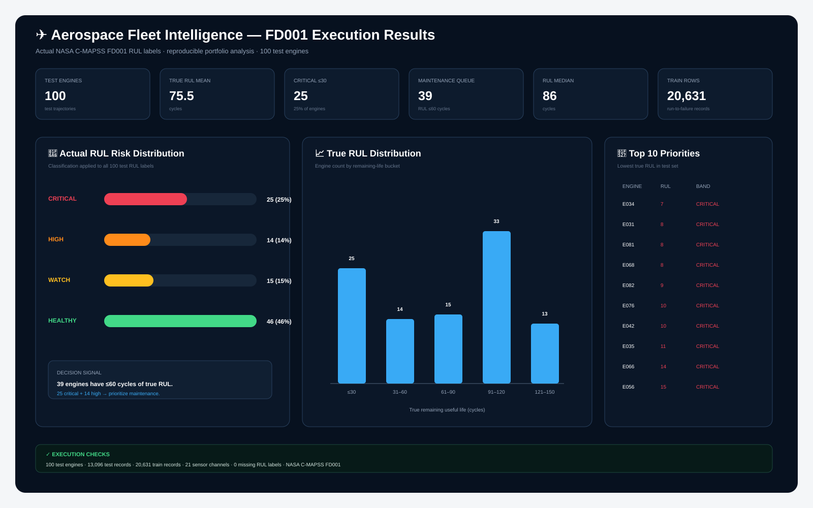
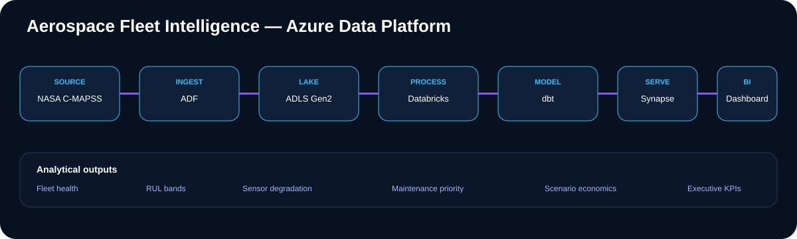

# ✈️ Aerospace Fleet Intelligence

A data engineering project built around NASA's C-MAPSS FD001 turbofan dataset. It takes engine-cycle data through an Azure-style data platform and turns it into RUL analysis, maintenance priorities, and a small Streamlit dashboard.

**Stack:** Azure Data Factory · ADLS Gen2 · Databricks/PySpark · dbt · Azure Synapse · Python · Streamlit · Plotly · GitHub Actions



## 🔎 What this project does

The project follows a simple path:

**ingest → store → clean → transform → model → report**

The repository contains the code and configuration for each part of that flow. The FD001 analysis and dashboard can be run locally from the repository. The Azure folders contain the corresponding cloud implementation files.

## 📌 Key takeaways

- **39 of 100 test engines** are at or below **60 cycles** of true RUL under the project's planning threshold.
- **25 engines** are at or below **30 cycles**.
- Fleet mean RUL is **75.52 cycles**, but the range is **7–145 cycles**. The low-RUL tail is therefore more useful for prioritization than the average by itself.
- The ten lowest-RUL engines are **E034, E031, E081, E068, E082, E076, E042, E035, E066, and E056**.
- The result file is used directly by the dashboard, so the numbers shown in the dashboard can be traced back to a committed CSV.
- The current analysis uses NASA's supplied test RUL labels for benchmark analysis. A real predictive system would replace those labels with model predictions made from data available at decision time.

## 📊 Results

| Metric | Result |
|---|---:|
| Test engines | **100** |
| Test records | **13,096** |
| Training records | **20,631** |
| Sensor measurements | **21** |
| Mean RUL | **75.52 cycles** |
| Median RUL | **86 cycles** |
| Minimum RUL | **7 cycles** |
| Maximum RUL | **145 cycles** |
| Critical (≤30) | **25 engines** |
| High (31–60) | **14 engines** |
| Maintenance queue (≤60) | **39 engines** |
| Watch (61–90) | **15 engines** |
| Healthy (>90) | **46 engines** |

### 🚦 RUL bands used in this project

| RUL | Band | Planning use |
|---:|---|---|
| ≤30 | 🔴 Critical | Review first |
| 31–60 | 🟠 High | Plan intervention |
| 61–90 | 🟡 Watch | Monitor more closely |
| >90 | 🟢 Healthy | Normal monitoring |

These are project analysis thresholds. They are **not aircraft maintenance limits**.

## 🏗️ Architecture



```text
NASA C-MAPSS
      ↓
Azure Data Factory
      ↓
ADLS Gen2 / Bronze
      ↓
Databricks + PySpark
      ↓
Silver → Gold
      ↓
dbt
      ↓
Azure Synapse
      ↓
Dashboard / BI
```

### ⚙️ ADF + ADLS

`adf/` contains the datasets, linked-service templates, and ingestion pipeline. The intended landing zone is ADLS Bronze, followed by Silver and Gold processing.

### ⚡ Databricks / PySpark

`databricks/01_bronze_to_silver.py` handles schema, typing, duplicate removal, and sensor feature calculations.

`databricks/02_silver_to_gold.py` creates the latest engine state and a simple condition-age baseline.

### 🧱 dbt

`dbt/` contains staging models, reporting marts, model tests/contracts, and a Synapse profile example.

### 🏢 Synapse

`synapse/` contains warehouse DDL and reporting views for fleet KPIs and the maintenance queue.

### 📈 Dashboard

`dashboard/app.py` reads `reports/fd001_engine_rul.csv` and calculates the dashboard metrics from that file. It includes:

- fleet summary KPIs
- RUL distribution
- risk-band counts
- maintenance priority table
- key findings

## 📁 Repository layout

| Folder | Purpose |
|---|---|
| `adf/` | ADF datasets, linked services, and pipeline |
| `assets/` | Architecture and project visuals |
| `dashboard/` | Streamlit dashboard |
| `data/raw/` | Local source-data instructions; full dataset excluded from Git |
| `data/reference/` | Schema/reference information |
| `databricks/` | PySpark transformations |
| `dbt/` | Staging and mart models |
| `docs/` | Architecture, data dictionary, findings, and runbook |
| `notebooks/` | FD001 analysis notebook |
| `reports/` | Executed result CSV and SVG |
| `scripts/` | Source-data download and result-build helpers |
| `src/` | Reusable Python analytics |
| `synapse/` | Warehouse tables and views |
| `tests/` | Automated tests |

## ▶️ Reproduce the local analysis

### 1. Clone the repository

```bash
git clone https://github.com/manishkallu01-wq/aerospace-fleet-intelligence.git
cd aerospace-fleet-intelligence
```

### 2. Create the Python environment

```bash
python -m venv .venv
source .venv/bin/activate
pip install -r requirements.txt
```

Windows PowerShell:

```powershell
.venv\Scripts\Activate.ps1
```

### 3. Get the NASA FD001 files

Download the public **NASA C-MAPSS Jet Engine Simulated Data** from the source listed at the bottom of this README. Extract the archive locally and place the FD001 files under:

```text
data/raw/
```

The result build needs:

```text
data/raw/RUL_FD001.txt
```

The full source archive is intentionally not committed to Git.

### 4. Build the engine-level results

```bash
python scripts/build_fd001_results.py
```

This reads `RUL_FD001.txt`, applies the project RUL bands, and writes:

```text
reports/fd001_engine_rul.csv
```

The output has one row per test engine:

```text
engine_id
true_rul_cycles
risk_band
priority
```

### 5. Run the tests

```bash
pytest -q
```

The tests check the RUL band boundaries and that the summary counts reconcile with the engine-level result file.

### 6. Start the dashboard

```bash
streamlit run dashboard/app.py
```

The dashboard reads the result file generated in Step 4.

### 7. Run the notebook

Open:

```text
notebooks/01_fd001_executed_analysis.ipynb
```

The same reusable functions are available in:

```text
src/aerospace_analytics.py
```

## 🔬 How the numbers are interpreted

The project uses the supplied FD001 test RUL values to answer a planning question: **which engines are closest to the end of their simulated run?**

A simple threshold of 60 cycles creates a planning queue of 39 engines. Splitting that queue at 30 cycles leaves 25 critical engines and 14 high-priority engines.

The mean RUL of 75.52 cycles should not be treated as a fleet-health score. It is an average of the benchmark labels. The wide 7–145 cycle range is why the project shows both fleet-level statistics and an engine-level priority list.

There is no dollar savings estimate in this project because FD001 does not contain actual airline maintenance costs, labor rates, downtime costs, or intervention decisions. A financial estimate without those inputs would be made up.

## ☁️ Azure implementation

The Azure components are included as project code/configuration and are designed around this flow:

```text
ADF → ADLS Bronze → Databricks/PySpark → Gold → dbt → Synapse → BI
```

The repository does not include an Azure subscription or credentials, so it does not claim that a live ADF, ADLS, Databricks, dbt, or Synapse run occurred.

For an Azure deployment, the files under `adf/`, `databricks/`, `dbt/`, and `synapse/` provide the starting implementation. `docs/runbook.md` lists the checks to perform after a cloud load.

## 🧪 Testing and CI

Run locally:

```bash
pytest -q
```

GitHub Actions runs the test suite on pushes and pull requests.

## ⚠️ RUL note

The FD001 test RUL values are ground-truth labels supplied for benchmark evaluation. They are not predictions produced by this project and would not be known to an operator before failure.

The current dashboard is therefore a **benchmark-results dashboard**. A production predictive-maintenance version would train and evaluate an RUL model using only information available at prediction time, then send those predictions through the same downstream reporting layers.

## 📚 Documentation

- [`docs/architecture.md`](docs/architecture.md) — platform layout and data grain
- [`docs/data_dictionary.md`](docs/data_dictionary.md) — dataset fields and definitions
- [`docs/runbook.md`](docs/runbook.md) — local and Azure setup
- [`docs/business_insights.md`](docs/business_insights.md) — interpretation of the results
- [`docs/portfolio_results.md`](docs/portfolio_results.md) — result summary
- [`reports/README.md`](reports/README.md) — generated result files

## 🔗 Data source

NASA C-MAPSS Jet Engine Simulated Data:  
https://data.nasa.gov/dataset/cmapss-jet-engine-simulated-data

## 🚀 Possible extensions

- Train and evaluate an actual RUL prediction model
- Add incremental Delta Lake processing
- Add data-quality checks in the pipeline
- Add model/data drift monitoring
- Add Azure Monitor and operational logging
- Add environment-based CI/CD deployment
- Add maintenance-capacity optimization

## 👤 Author

**Manish Reddy Kallu**  
Data Engineering Portfolio

GitHub: https://github.com/manishkallu01-wq

> Independent portfolio project using public/simulated data. It is not a NASA, airline, aircraft manufacturer, or certified aviation maintenance system.
